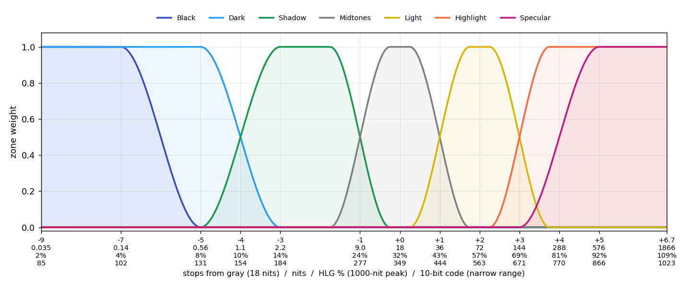

# OBS HDR Toolkit

HDR-safe video filters for OBS Studio, working in OBS's linear HDR space without
8-bit intermediates or hidden clamps:

* **HDR Transform** - four-corner pin, bilinear (StreamFX-style) or projective.
  3D modes are planned.
* **HDR Color** - white balance (temperature / tint), exposure, contrast and pivot,
  saturation, colour-balance wheel, seven tonal zones, linear offset, Grade Mix,
  and low / high soft clip.

* **HDR Program Denoise** (Tools menu, in development) - processes the finished
  program picture once per frame after transitions. HQDN3D-style spatial + temporal
  denoise (an independent implementation) with scene-cut reset and transition
  protection, in OBS's HDR working space; plus an Identity transparency test and a
  D3D11 compute spike (Windows). NLMeans follows.

Developer tools in the same package: **HDR Toolkit: Test Pattern (developer)**
(exact HDR values: neutral patches 0-10,000 nits, log ramp, HLG 0-109% levels,
wide-gamut colours, alpha fixtures; no video decode) and **HDR Toolkit: Neutral
(developer test)** (a real HDR shader that must leave the image unchanged).

**Status: development build.** Do not install into a production OBS profile.
`docs/VALIDATION.md` lists what has been verified (CPU maths, builds) and what
is still NOT RUN in OBS.

## HDR Color: tonal zones

Zones are placed in stops from a gray reference (18 nits by default, Advanced).
Each tick shows stops / nits / HLG % (1000-nit peak) / 10-bit narrow-range code.
The chart stops at -9 stops (below that is camera noise; Black and Dark carry on
down to true black) and at code 1023, OBS's HLG encode ceiling.

| Zone | Full strength | Hands over at |
|---|---|---|
| Black | below -7 (fades out by -5) | sits on top of Dark |
| Dark | down to black, up to -5 | -4 (HLG 10%, code 154) |
| Shadow | -3 to -1.75 | -1 (24%, 277) |
| Midtones | -0.25 to +0.25 | +1 (43%, 444) |
| Light | +1.75 to +2.25 | +3 (69%, 671) |
| Highlight | +3.75 up to peak | |
| Specular | from +5 (92%), fading in from +3 | sits on top of Highlight |

* Dark, Shadow, Midtones, Light and Highlight share mirrored fades at each
  handover, so their weights always add up to 1: the same push on neighbouring
  zones is an even push, with no doubling at the seams.
* Masks are measured after white balance and global exposure, then frozen, so a
  zone adjustment never moves a pixel into another zone.
* Zone exposure is a gain: it cannot lift true black. Use **Offset** for that.
* Keep a single zone push within about +-1 EV (1.5-stop fades); beyond that,
  tones inside a fade can cross over. Widen the fade for bigger pushes.
* Every range, open end and fade is adjustable per zone; *Advanced > Diagnostic
  view* shows one zone's mask or all zones in false colour.

## Install (Windows, test profile)

1. Download the `obs-hdr-toolkit-<version>-windows-x64-<commit>` artifact from
   the latest successful *Push* run under **Actions**, and unzip it (it contains
   a second zip; unzip that too).
2. Close OBS. Copy the `obs-hdr-toolkit` folder (containing `bin\64bit\obs-hdr-toolkit.dll`
   and `data\`) into `C:\ProgramData\obs-studio\plugins\`. **Create the `obs-studio\plugins`
   folders if they do not exist** (they don't on a fresh install; `ProgramData` is hidden).
   Alternative, Program Files layout (the folder structure is different):
   `bin\64bit\obs-hdr-toolkit.dll` -> `C:\Program Files\obs-studio\obs-plugins\64bit\`, and the
   *contents* of `data\` -> `C:\Program Files\obs-studio\data\obs-plugins\obs-hdr-toolkit\`.
3. To uninstall, delete `C:\ProgramData\obs-studio\plugins\obs-hdr-toolkit`.

This location is separate from the OBS install folder, so it does not touch
other plugins.

## Documentation

* `docs/ARCHITECTURE.md` - pinned versions, layout, build
* `docs/COLOR_PIPELINE.md` - colour-space, units and alpha contract
* `docs/STREAMFX_REFERENCE.md` - StreamFX provenance and licence audit
* `docs/PARAMETER_SCHEMA.md` - every saved setting, defaults and ranges
* `docs/denoise/` - program denoise brief and design notes
* `docs/VALIDATION.md` - PASS / FAIL / NOT RUN table

## Licence

GPL-2.0-or-later. See `LICENSE` and `THIRD_PARTY_NOTICES.md`.
